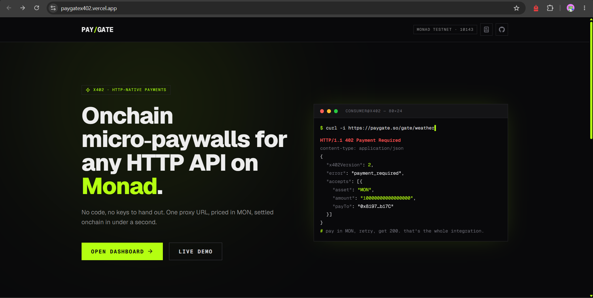
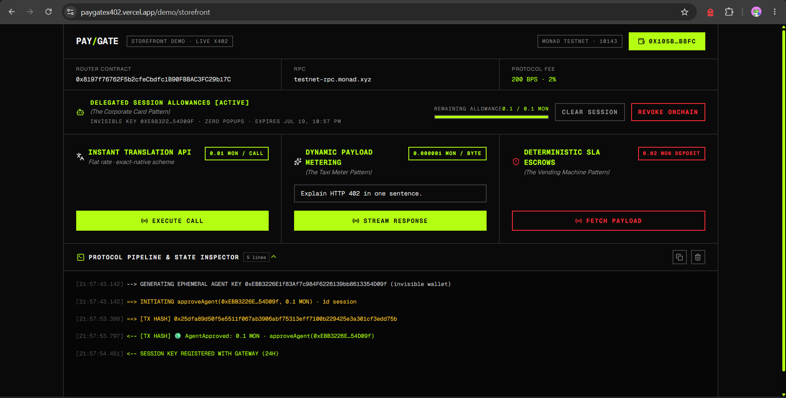
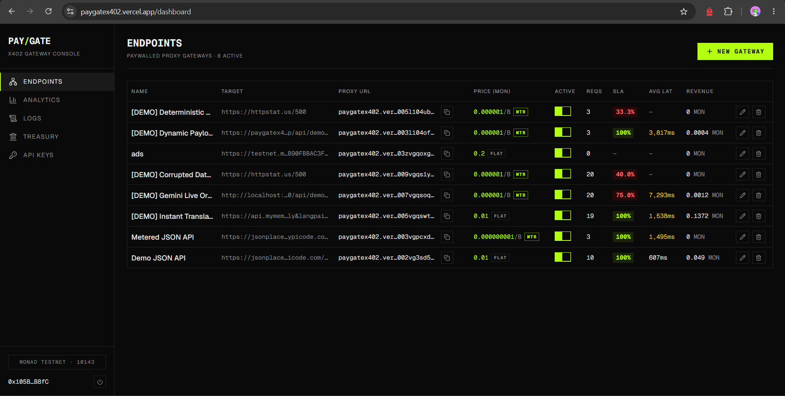
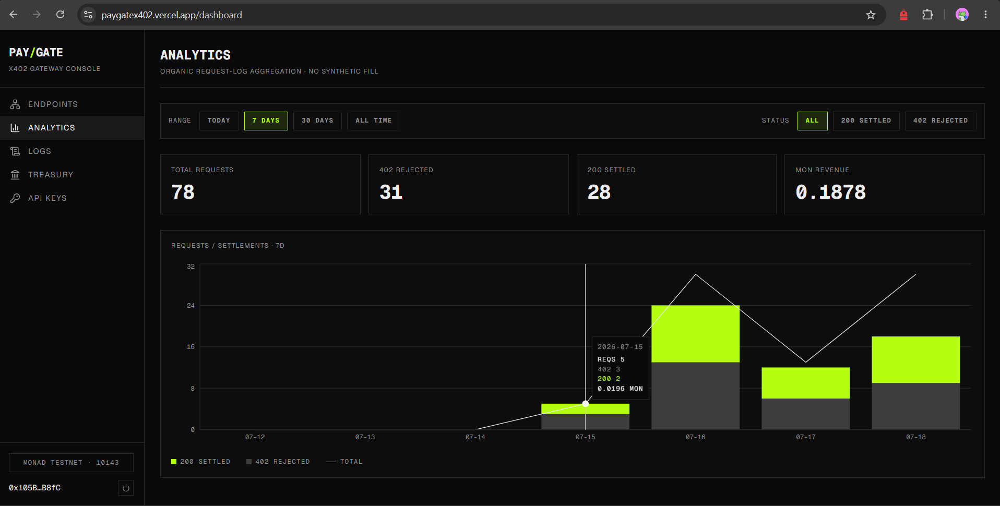
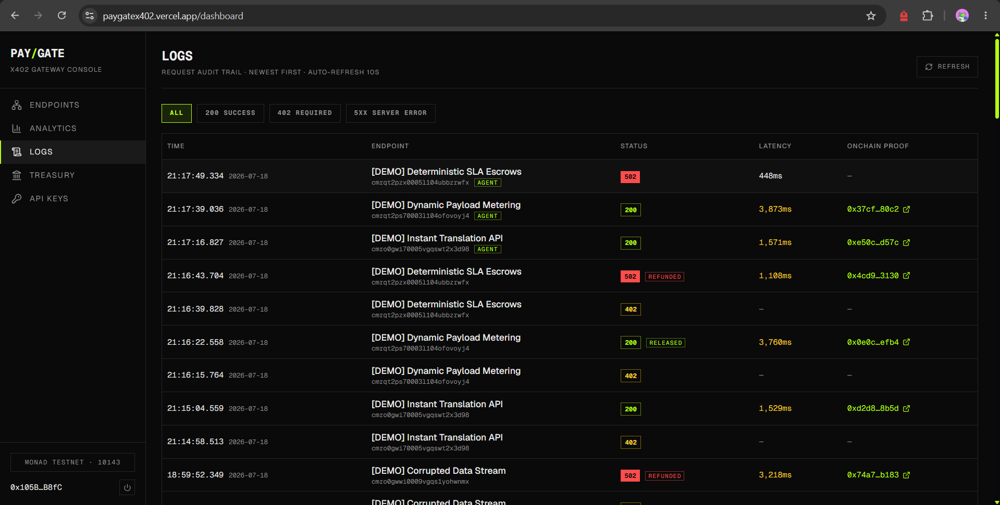

# PayGate



**No-code API monetization on Monad Testnet.**

Paste any HTTP API URL into the dashboard, set a price in MON, and get a proxy URL that enforces an x402-style paywall: unpaid requests receive HTTP `402` with onchain payment requirements; after the consumer pays the `PayGateRouter` contract in native MON, the gateway verifies the transaction against the RPC and forwards the request to the target API.

---

## Why Monad?

x402 micro-transactions — per-request fees of a fraction of a cent, and per-byte metering settled after every response — are **impossible on Ethereum Mainnet**. Gas alone would dwarf the payment. On typical L2s, multi-second block times and confirmation lag make real-time paywalls feel broken: consumers wait, agents stall, and escrow refunds arrive too late to matter. **Monad's ~400ms block times, massive TPS, and full EVM compatibility are the only stack where trustless API paywalls can settle in the same request lifecycle** without destroying developer or consumer UX. PayGate is built for that reality — every `processPayment`, `chargeAgent`, `settleEscrow`, and `refundEscrow` is designed to complete while the HTTP connection is still open.

---

## Core Features

Beyond flat per-request pricing, PayGate ships three x402 extensions:

> **Delegated Session Allowances** *(The Corporate Card Pattern)*
>
> Issue a pre-authorized corporate expense limit to an autonomous agent. A master wallet escrows an allowance for an ephemeral agent key; the agent then makes signed requests with no 402 challenge and no wallet popups. The platform settles each call onchain via `chargeAgent`.

> **Dynamic Payload Metering** *(The Taxi Meter Pattern)*
>
> Endpoints priced per byte. The consumer escrows a maximum deposit; the gateway meters the exact response size, settles the actual cost, and the contract refunds the unspent remainder in the same transaction.

> **Deterministic SLA Escrows** *(The Vending Machine Pattern)*
>
> If the upstream API returns 5xx or times out, the gateway automatically fires `refundEscrow` and the consumer gets 100% of the deposit back — no support ticket, no goodwill, just the state machine.



---

## Architecture

| Path | Role |
| --- | --- |
| `contracts/` | Foundry project. `PayGateRouter.sol`: flat payments (`processPayment`), developer balances (`withdrawEarnings`), agent allowances (`approveAgent` / `chargeAgent` / `revokeAgent`), and per-request escrows (`depositEscrow` / `settleEscrow` / `refundEscrow`). 2% protocol fee on every settlement path. |
| `app/api/v1/gate/[proxyId]/route.ts` | The x402 gateway. Routes each request through one of three workflows (Delegated Session Allowances, Dynamic Payload Metering / Deterministic SLA Escrows, or flat) with onchain verification via viem, replay protection through a unique `txHash` constraint, byte metering, and automated settlement/refund from the platform relayer. |
| `app/api/session-keys` | Registers agent session keys after verifying the onchain allowance; lists and deactivates them. |
| `app/api/{developers,endpoints,analytics,ping}` | Dashboard CRUD and analytics aggregation over Prisma. |
| `app/dashboard` | Developer console (wagmi + Reown AppKit): endpoint manager with FLAT/METERED billing, 3-step gateway creation modal, analytics charts, treasury withdraw, API keys. |
| `prisma/` | PostgreSQL schema: `Developer`, `Endpoint` (its id doubles as the proxy id; billing type and per-byte price), `RequestLog` (status, revenue, escrow state, response bytes, session key used), `SessionKey`. |
| `scripts/` | Reference consumers: `consumer-demo.ts` (flat), `agent-session-demo.ts` (Delegated Session Allowances), `metered-demo.ts` (Dynamic Payload Metering + Deterministic SLA Escrows). |

---

## Deployed Contract

| | |
| --- | --- |
| Contract | `PayGateRouter` |
| Network | Monad Testnet (chain id `10143`) |
| Address | `0x8197f76762F5b2cfeCbdfc1B90FBBAC3FC29b17C` |
| Explorer | [testnet.monadvision.com](https://testnet.monadvision.com/address/0x8197f76762F5b2cfeCbdfc1B90FBBAC3FC29b17C) |
| Protocol fee | 2% (200 bps) to the treasury; 98% credited to the developer |
| Owner | The platform backend relayer wallet — sole caller of `chargeAgent`, `settleEscrow`, `refundEscrow` |

Developer earnings accumulate in the contract's `balances` mapping and stay there until the developer calls `withdrawEarnings()` (available from the dashboard's Treasury view).

---

## Dashboard & Analytics

Operator surfaces for gateway lifecycle, revenue, and settlement auditability.





---

## Quickstart

```bash
npm install
npx prisma db push          # syncs schema to your PostgreSQL database
npm run dev                 # http://localhost:3000
```

Create a `.env` at the repo root first (see [Environment variables](#environment-variables-env)). Open `http://localhost:3000/dashboard`, connect a wallet via the Reown AppKit modal on Monad Testnet, and create a gateway.

Contract development (optional, requires Foundry):

```bash
cd contracts
forge test
```

---

## How the 402 Handshake Works

1. Call the proxy URL without payment:

```bash
curl -i http://localhost:3000/api/v1/gate/<proxyId>
```

The gateway responds with `402 Payment Required`. The body (also base64-encoded in the `Payment-Required` header) is x402 v2-shaped:

```json
{
  "x402Version": 2,
  "error": "payment_required",
  "accepts": [{
    "scheme": "exact-native",
    "network": "eip155:10143",
    "asset": "MON",
    "amount": "10000000000000000",
    "payTo": "0x038100f6FE0DB935e4658Eb766f7AC5c25C665cB",
    "extra": {
      "developer": "0x...",
      "contract": "0x038100f6FE0DB935e4658Eb766f7AC5c25C665cB",
      "function": "processPayment(address)",
      "chainId": 10143,
      "rpcUrl": "https://testnet-rpc.monad.xyz"
    }
  }]
}
```

2. Pay onchain: call `processPayment(developer)` on the router with `value = amount`.

3. Retry with the transaction hash in the `Payment-Signature` header (base64 JSON `{"txHash":"0x...","payer":"0x..."}`):

```bash
curl -i http://localhost:3000/api/v1/gate/<proxyId> \
  -H "Payment-Signature: $(echo -n '{"txHash":"0x...","payer":"0x..."}' | base64)"
```

The gateway verifies the receipt (correct contract, matching developer, amount at least the price, transaction not previously used), forwards the request, and returns the upstream response with an `X-Payment-Response` header. Reusing a transaction hash returns `409 payment_replay`.

The whole loop can be exercised with the demo script (uses `TEST_CONSUMER_PRIVATE_KEY` from `.env` as the consumer wallet):

```bash
npm run demo:consumer -- http://localhost:3000/api/v1/gate/<proxyId>
```

---

## Delegated Session Allowances

*(The Corporate Card Pattern)*

1. In the **Storefront UI**, authorize an autonomous agent: the master wallet escrows an allowance onchain via `approveAgent(agent, allowance)` and the gateway registers the session (`POST /api/session-keys`).
2. Copy the ephemeral private key from the browser session (`sessionStorage` key `paygate_demo_agent_key`) into your environment as `AGENT_SESSION_PRIVATE_KEY`.
3. The agent calls any gateway with three headers instead of a payment:
   - `X-Agent-Address` — the agent public address
   - `X-Agent-Timestamp` — unix seconds (±120s skew accepted)
   - `X-Agent-Signature` — EIP-191 signature over `paygate:agent:<proxyId>:<timestamp>`

No 402 is returned. The platform settles each call via `chargeAgent(master, agent, developer, cost)`. The demo script is **agent-only** — it never holds the master key:

```bash
# After authorizing a session in /demo/storefront:
AGENT_SESSION_PRIVATE_KEY=0x... npm run demo:agent -- http://localhost:3000/api/v1/gate/<proxyId>
```

Revoke from the Storefront UI (`revokeAgent`) when finished.

---

## Dynamic Payload Metering

*(The Taxi Meter Pattern)*

Create an endpoint with `billingType: "METERED"` and a per-byte price. The 402 then advertises the `metered-escrow` scheme with `pricePerByteWei`, `maxDepositWei` (price per byte × 20,000 bytes), and a server-generated `requestId`:

1. Escrow the deposit: `depositEscrow(developer, requestId)` with `value = maxDepositWei`.
2. Retry with `Payment-Signature: base64({"txHash": "<deposit tx>", "requestId": "0x...", "payer": "0x..."})`.
3. The gateway forwards the request, counts the exact bytes returned, and calls `settleEscrow(requestId, actualCost)`: the developer is credited `actualCost` minus the 2% fee, and the unspent deposit returns to the consumer in the same transaction. A zero-byte response settles at cost 0 (full refund, no fee).

```bash
npm run demo:metered -- http://localhost:3000/api/v1/gate/<meteredProxyId>
```

---

## Deterministic SLA Escrows

*(The Vending Machine Pattern)*

If the upstream returns 5xx or times out (30s), the gateway calls `refundEscrow(requestId)` automatically — 100% of the deposit returns to the consumer and the response carries an `X-PayGate-Refund` header with the refund transaction. If a settlement transaction itself fails, funds remain safely held in the contract (`escrowStatus: HELD`) for a platform retry.

Every refund and settlement is visible in the operator audit trail:



---

## Environment Variables (`.env`)

| Variable | Purpose |
| --- | --- |
| `PAYGATE_RELAYER_PRIVATE_KEY` | The private key of the platform's backend relayer wallet. This wallet must be funded with MON to pay gas fees when settling `chargeAgent` and `refundEscrow` transactions on behalf of users. Must match the PayGateRouter `owner` address. |
| `TEST_CONSUMER_PRIVATE_KEY` | Requires `TEST_CONSUMER_PRIVATE_KEY` in `.env` to simulate a customer wallet transaction. Used by `demo:consumer` / `demo:metered` only — not by the gateway. |
| `AGENT_SESSION_PRIVATE_KEY` | Ephemeral agent key for `demo:agent` only. Generate via Storefront UI after `approveAgent`; never the master wallet key. |
| `DATABASE_URL` | PostgreSQL connection string. |
| `NEXT_PUBLIC_PAYGATE_ROUTER` | Deployed `PayGateRouter` address the gateway verifies payments against. |
| `NEXT_PUBLIC_MONAD_RPC` | Monad Testnet RPC URL (defaults to `https://testnet-rpc.monad.xyz`). |
| `NEXT_PUBLIC_EXPLORER_URL` | Block explorer base URL used for links in the dashboard. |

---

*Built for Monad. Settled in milliseconds. Monetized at the HTTP layer.*
